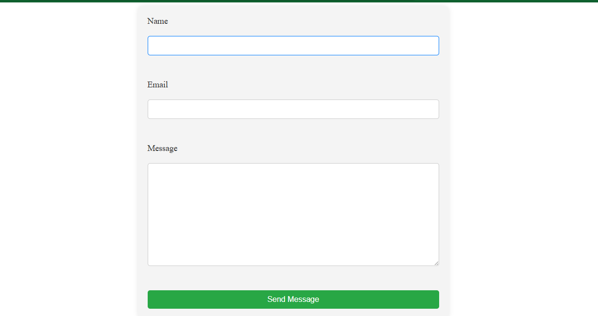
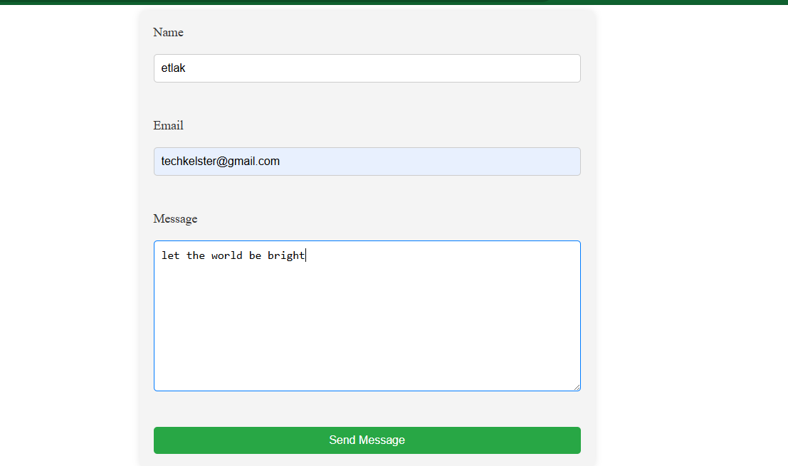
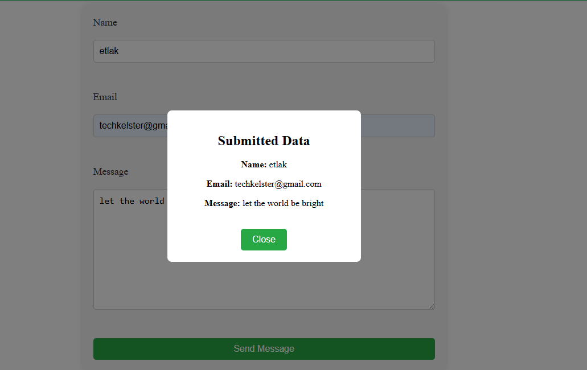
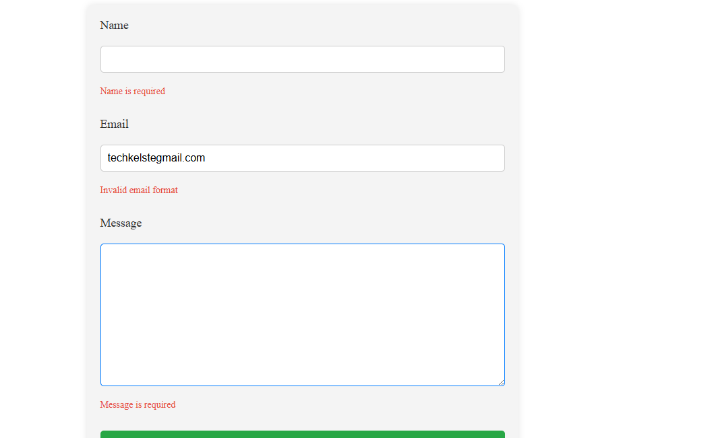

# Contact Form

A simple contact form built with React and TypeScript emphasising on the usage of react-hook-form library.

## Features

- Form validation
- Error Display
- Form data display

## Installation

1. Clone the repository
2. Install dependencies: `npm install`
3. Start the development server: `npm run dev`

## ScreenShots

